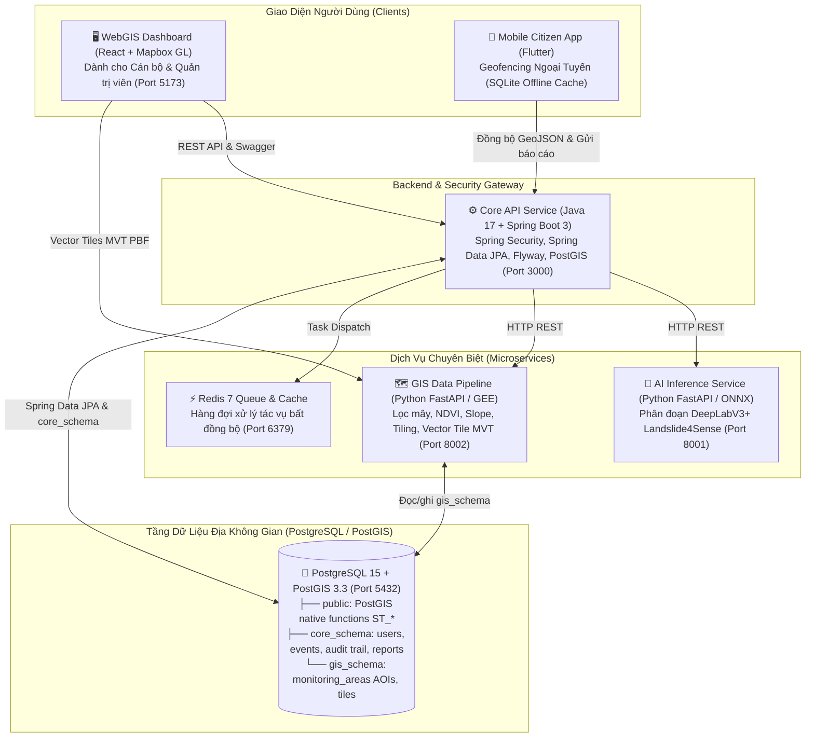

<div align="center">

# 🛰️ GEOSENTRY (TERRAWATCH)
### HỆ THỐNG PHÁT HIỆN & CẢNH BÁO SẠT LỞ ĐẤT VIỄN THÁM ĐA PHÂN HỆ
**Đồ Án Tốt Nghiệp Kỹ Sư Phần Mềm (Software Engineering Capstone Project)**

[](.github/workflows/ci-core-api.yml)
[](.github/workflows/ci-ai-service.yml)
[](.github/workflows/ci-webgis.yml)
[](docker-compose.yml)
[](database)
[](LICENSE)

<br/>

[Tổng Quan](#-tổng-quan-đề-tài) • 
[Kiến Trúc Hệ Thống](#-kiến-trúc-hệ-thống-microservices) • 
[Cấu Trúc Thư Mục](#-cấu-trúc-chi-tiết-toàn-bộ-dự-án) • 
[Kiến Trúc CSDL & Migrations](#-kiến-trúc-csdl-schema-per-service--migrations) • 
[Cách Chạy Dự Án](#-hướng-dẫn-chạy-dự-án-chi-tiết) • 
[Tài Liệu Kỹ Thuật](#-tài-liệu-kỹ-thuật)

</div>

---

## 📌 Tổng Quan Đề Tài

Hệ thống **GeoSentry (TerraWatch)** là giải pháp công nghệ viễn thám và trí tuệ nhân tạo toàn diện nhằm giám sát và cảnh báo sớm thiên tai trượt lở đất tại các tỉnh miền núi phía Bắc Việt Nam (Yên Bái, Lào Cai, Hà Giang).

Hệ thống hoạt động theo quy trình **bán tự động (Semi-automated)**:
1. **Thu thập**: Vệ tinh Sentinel-2 quang học đa phổ độ phân giải 10m quét định kỳ.
2. **Tiền xử lý & AI**: Lọc mây, tính toán chỉ số $\Delta\text{NDVI}$ và độ dốc (Slope), cắt ảnh thành các patch để mô hình DeepLabV3+/U-Net (Landslide4Sense) phân đoạn nhận diện.
3. **Thẩm định**: Cán bộ chuyên môn kiểm tra hàng đợi trên WebGIS Dashboard và phê duyệt.
4. **Phát tán đa kênh**: Kích hoạt gửi thông báo khẩn qua FCM Push, SMS, và đặc biệt hỗ trợ **Geofencing ngoại tuyến trên ứng dụng di động** (rung chuông báo động ngay cả khi mất sóng 4G/Internet).

---

## 🏗️ Kiến Trúc Hệ Thống (Microservices)

Mô hình **Modular Monorepo Polyglot Microservices**:



---

## 📁 Cấu Trúc Chi Tiết Toàn Bộ Dự Án

```
SECapstone/
├── .agents/                               # Bộ kỹ năng AI Agentic: 46 BMAD skills & Ponytail rules
│   ├── rules/
│   │   └── ponytail.md                    # Quy tắc "Lazy Senior Dev" (YAGNI, tối giản mã nguồn)
│   └── skills/                            # Các role BMAD (Architect, Analyst, Developer,...)
├── .github/
│   ├── ISSUE_TEMPLATE/                    # Mẫu Issue báo cáo lỗi và đề xuất tính năng
│   ├── pull_request_template.md           # Mẫu PR bắt buộc đối soát Use Case & WBS
│   ├── copilot-instructions.md            # Chỉ dẫn kỹ thuật cho Copilot
│   └── workflows/                         # Path-based CI/CD độc lập từng service
│       ├── ci-core-api.yml                # CI cho Java 17 Spring Boot 3 Maven
│       ├── ci-ai-service.yml              # CI cho Python FastAPI AI Service
│       └── ci-webgis.yml                  # CI cho React 18 WebGIS Dashboard
├── database/                              # Quản lý CSDL Địa không gian PostGIS
│   ├── init.sql                           # DDL Schema-per-Service (core_schema, gis_schema), Triggers, Views
│   ├── seed.sql                           # Dữ liệu kiểm thử mẫu (Yên Bái, Lào Cai, Hà Giang)
│   └── migrations/                        # Các bản migration đánh số tuần tự (Flyway format)
│       ├── V1__init_postgis_schema.sql
│       └── V2__seed_vietnam_geospatial_data.sql
├── services/
│   ├── core-api/                          # [Java 17 + Spring Boot 3] Core Backend Service
│   │   ├── pom.xml                        # Maven dependencies: Spring Data JPA, Security 6, Flyway, Swagger
│   │   ├── Dockerfile                     # Multi-stage build (Maven 3.9 + Temurin 17 JRE)
│   │   └── src/main/
│   │       ├── java/vn/terrawatch/core/
│   │       │   ├── TerraWatchCoreApplication.java
│   │       │   ├── config/                # SecurityConfig, OpenApiConfig
│   │       │   ├── controller/            # REST Controllers: Landslides, Areas, Reports, Alerts
│   │       │   ├── dto/                   # Java 17 Records bất biến
│   │       │   ├── entity/                # JPA Entities (@Table(schema = "core_schema" / "gis_schema"))
│   │       │   ├── repository/            # JpaRepositories + SpatialRepository (Native PostGIS)
│   │       │   └── service/               # Logic nghiệp vụ & Transaction management
│   │       └── resources/
│   │           ├── application.yml        # Cấu hình currentSchema=core_schema,gis_schema,public & Flyway
│   │           └── db/migration/          # Thư mục Flyway tự động chạy migration khi khởi động
│   ├── ai-service/                        # [Python 3.11 + FastAPI] AI Inference Service
│   │   ├── app/
│   │   │   ├── main.py                    # Endpoints: /api/v1/inference, /api/v1/models/info
│   │   │   └── services/inference.py      # Bọc mô hình DeepLabV3+ ONNX, vector hóa mặt nạ
│   │   ├── requirements.txt
│   │   └── Dockerfile
│   └── gis-service/                       # [Python 3.11 + FastAPI] GIS Data Pipeline Service
│       ├── app/
│       │   ├── main.py                    # Endpoints: /api/v1/gis/query-satellite, /tiling, /mvt
│       │   └── pipeline/processor.py      # Tính toán NDVI, Slope, Cắt ảnh Tiling
│       ├── requirements.txt
│       └── Dockerfile
├── apps/
│   ├── webgis/                            # [React 18 + Vite] Dashboard Cán Bộ Thẩm Định
│   │   ├── src/
│   │   │   ├── App.jsx                    # Giao diện trung tâm cảnh báo quốc gia, radar scan
│   │   │   ├── index.css                  # Phong cách phòng điều hành (Command Center)
│   │   │   └── main.jsx
│   │   ├── package.json
│   │   ├── vite.config.js
│   │   └── Dockerfile
│   └── mobile/                            # [Flutter 3.x] Ứng Dụng Di Động Dành Cho Người Dân
│       ├── lib/
│       │   ├── main.dart
│       │   └── services/
│       │       └── geofencing_service.dart# Thuật toán Haversine & Ray Casting chạy offline
│       └── pubspec.yaml
├── docs/                                  # Bộ tài liệu kỹ thuật hoàn chỉnh
│   ├── ARCHITECTURE.md                    # Tài liệu kiến trúc C4 Model & Database Schema-per-Service
│   ├── AI_MODEL_CARD.md                   # Hồ sơ nghiên cứu mô hình AI (Landslide4Sense Benchmark)
│   └── microservices-setup-guide.md       # Hướng dẫn thiết lập repo, quy ước Git và CI/CD
├── scripts/
│   └── migrate.py                         # Tool CLI Migration CSDL dùng chung (như Prisma migrate)
├── docker-compose.yml                     # File điều phối khởi chạy toàn bộ 6 services
├── Makefile                               # Bộ phím tắt điều hành dự án 1 lệnh
├── CONTRIBUTING.md                        # Quy chuẩn commit Conventional Commits & làm việc nhóm
└── .env.example                           # Mẫu cấu hình biến môi trường
```

---

## 🗄️ Kiến Trúc CSDL (Schema-per-Service) & Migrations

### 1. Kiến trúc CSDL: Logical Schema-per-Service (Phương án A)
Nhằm đảm bảo ranh giới dữ liệu độc lập giữa các Microservices nhưng vẫn tận dụng được sức mạnh tính toán hình học native của PostGIS (0ms network latency), hệ thống chia tách CSDL thành các schema logic:
- **`public`**: Chứa extension `postgis`, `uuid-ossp`, và bảng kiểm soát migration `public.schema_migrations`.
- **`core_schema`**: Dành riêng cho **Core API (Java Spring Boot 3)**, gồm: `users`, `landslide_events`, `landslide_event_history`, `community_reports`, `v_active_landslide_zones`.
- **`gis_schema`**: Dành riêng cho **GIS Data Service (Python FastAPI)**, gồm: `monitoring_areas` (AOIs), siêu dữ liệu phân mảnh ảnh vệ tinh.

### 2. Hai Cơ Chế Database Migrations Song Hành

Để mọi service và lập trình viên trong nhóm có thể quản lý CSDL nhất quán như lệnh `npx prisma migrate` hoặc `npm run typeorm migration:run` ở Node.js, dự án hỗ trợ:

#### Cách 1: Tự động qua Spring Boot Flyway (Khuyên dùng khi chạy app)
Mỗi khi service `core-api` khởi động, Flyway tự động đọc các file trong `services/core-api/src/main/resources/db/migration/` và áp dụng các bản migration mới vào CSDL PostGIS theo schemas `core_schema,gis_schema`.

#### Cách 2: Chạy lệnh CLI thủ công qua Makefile / Python (Dành cho mọi service)
Nếu bạn đang phát triển các service khác (AI, GIS, WebGIS) và muốn kiểm tra hoặc cập nhật CSDL:

```bash
# 1. Chạy tất cả các bản migration mới nhất (Tương đương 'npx prisma migrate dev')
make migrate
# hoặc: python scripts/migrate.py up

# 2. Xem trạng thái các bản migration (Đã chạy hay đang chờ)
make db-status
# hoặc: python scripts/migrate.py status

# 3. Nạp lại dữ liệu mẫu kiểm thử
make seed
```

> **Ghi chú**: Lệnh `make migrate` được viết thông minh trong [scripts/migrate.py](file:///d:/SECapstone/scripts/migrate.py): tự động phát hiện container Docker `terrawatch-postgis` để thực thi, do đó **không đòi hỏi máy tính cá nhân phải cài đặt PostgreSQL**.

---

## 🚀 Hướng Dẫn Chạy Dự Án Chi Tiết

### CÁCH 1: Khởi Chạy 1 Lệnh Bằng Docker Compose (Khuyên dùng khi Demo)

Toàn bộ 6 thành phần (PostGIS, Redis, Core API, AI Service, GIS Service, WebGIS) sẽ được khởi tạo tự động:

```bash
# Bước 1: Sao chép file cấu hình môi trường
cp .env.example .env

# Bước 2: Khởi động toàn bộ Microservices
make up
# hoặc: docker-compose up -d --build

# Bước 3: Xem log hệ thống đang chạy
make logs

# Bước 4: Dừng hệ thống khi kết thúc
make down
```

---

### CÁCH 2: Khởi Chạy Từng Service Riêng Lẻ (Dành cho Lập trình viên)

Nếu bạn chỉ phụ trách phát triển 1 service cụ thể trong nhóm:

#### 1. Khởi động CSDL PostGIS & Redis nền:
```bash
docker compose up -d postgres redis
make migrate
```

#### 2. Chạy Core API (Java Spring Boot 3):
```bash
cd services/core-api
mvn spring-boot:run
# API sẵn sàng tại: http://localhost:3000
# Swagger UI tại: http://localhost:3000/swagger-ui.html
```

#### 3. Chạy AI Inference Service (Python FastAPI):
```bash
cd services/ai-service
python -m venv venv
# Windows:
venv\Scripts\activate
# Linux/macOS:
source venv/bin/activate

pip install -r requirements.txt
uvicorn app.main:app --host 0.0.0.0 --port 8001 --reload
# API Docs tại: http://localhost:8001/docs
```

#### 4. Chạy GIS Pipeline Service (Python FastAPI):
```bash
cd services/gis-service
python -m venv venv
venv\Scripts\activate
pip install -r requirements.txt
uvicorn app.main:app --host 0.0.0.0 --port 8002 --reload
# API Docs tại: http://localhost:8002/docs
```

#### 5. Chạy WebGIS Dashboard (React + Vite):
```bash
cd apps/webgis
npm install
npm run dev
# Dashboard mở tại: http://localhost:5173
```

#### 6. Chạy Mobile App (Flutter):
```bash
cd apps/mobile
flutter pub get
flutter run
```

---

## 🌐 Danh Mục Cổng Dịch Vụ & Tài Liệu API

| Dịch Vụ | Địa chỉ truy cập | Tài liệu tương tác / Swagger | Công nghệ |
| :--- | :--- | :--- | :--- |
| **WebGIS Dashboard** | [http://localhost:5173](http://localhost:5173) | Giao diện điều hành trực quan | React 18, Mapbox GL JS |
| **Core API** | [http://localhost:3000](http://localhost:3000) | [http://localhost:3000/swagger-ui.html](http://localhost:3000/swagger-ui.html) | Java 17, Spring Boot 3, JPA |
| **AI Service** | [http://localhost:8001](http://localhost:8001) | [http://localhost:8001/docs](http://localhost:8001/docs) | Python 3.11, FastAPI, ONNX |
| **GIS Service** | [http://localhost:8002](http://localhost:8002) | [http://localhost:8002/docs](http://localhost:8002/docs) | Python 3.11, FastAPI, GEE |
| **PostGIS Database** | `localhost:5432` | `terrawatch` (user: `postgres`) | PostgreSQL 15, PostGIS 3.3 |
| **Redis Queue** | `localhost:6379` | Message broker | Redis 7 Alpine |

---

## 👥 Phân Công Vai Trò WBS (Work Breakdown Structure)

| Thành viên | Vai trò | Trách nhiệm chính | Thư mục đảm nhiệm |
| :---: | :--- | :--- | :--- |
| **Thành viên 1** | **AI Engineer** | Huấn luyện mô hình DeepLabV3+/U-Net trên dataset Landslide4Sense, tối ưu F1=0.768, IoU=0.642, đóng gói ONNX Runtime. | [`services/ai-service/`](services/ai-service) |
| **Thành viên 2** | **GIS Data Engineer** | Xây dựng pipeline GEE/Sentinel Hub, lọc mây, tính toán chỉ số $\Delta\text{NDVI}$, độ dốc (Slope), cắt ảnh (Tiling), Vector Tile MVT. | [`services/gis-service/`](services/gis-service) |
| **Thành viên 3** | **Backend Engineer** | Thiết kế kiến trúc Microservices, Core API (Java Spring Boot 3), bảo mật Spring Security, Spring Data JPA, Flyway, PostGIS. | [`services/core-api/`](services/core-api) |
| **Thành viên 4** | **Frontend WebGIS** | Xây dựng Dashboard ReactJS, tích hợp Mapbox GL JS, bản đồ so sánh đa thời gian, quản lý hàng đợi thẩm định. | [`apps/webgis/`](apps/webgis) |
| **Thành viên 5** | **Mobile Engineer** | Ứng dụng di động Flutter, thuật toán Geofencing ngoại tuyến (Haversine & Ray Casting), SQLite cache $\ge 10,000$ điểm. | [`apps/mobile/`](apps/mobile) |

---

## 📚 Tài Liệu Kỹ Thuật

- 📘 [Tài Liệu Thiết Kế Kiến Trúc Phần Mềm C4 Model (docs/ARCHITECTURE.md)](docs/ARCHITECTURE.md)
- 🤖 [Đặc Tả Kỹ Thuật Mô Hình Trí Tuệ Nhân Tạo (docs/AI_MODEL_CARD.md)](docs/AI_MODEL_CARD.md)
- ⚙️ [Hướng Dẫn Quản Trị GitHub Repo & Database Migration (docs/microservices-setup-guide.md)](docs/microservices-setup-guide.md)
- 🤝 [Quy Chuẩn Đóng Góp & Commit (CONTRIBUTING.md)](CONTRIBUTING.md)
- 🗃️ [Kịch Bản Khởi Tạo CSDL PostGIS](database/init.sql)
- 📋 [Tài Liệu Yêu Cầu & Thiết Kế Gốc](Tai_Lieu_Yeu_Cau_Va_Thiet_Ke_He_Thong_Canh_Bao_Sat_Lo_Dat.docx)
