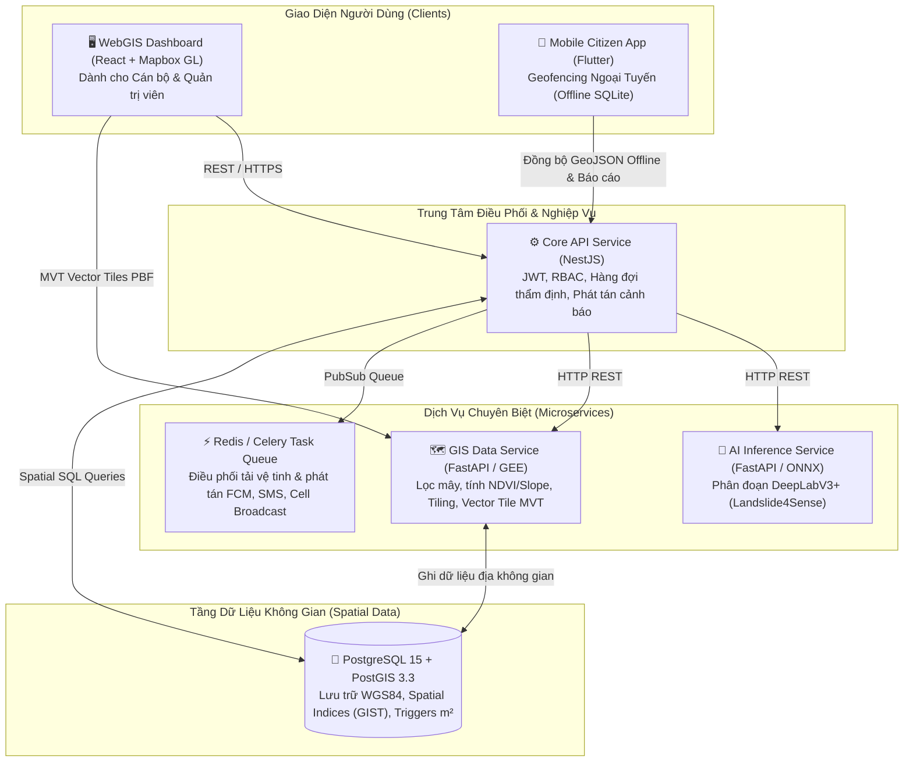

<div align="center">

# 🛰️ GEOSENTRY (TERRAWATCH)
### HỆ THỐNG PHÁT HIỆN & CẢNH BÁO SẠT LỞ ĐẤT VIỄN THÁM ĐA PHÂN HỆ
**Đồ Án Tốt Nghiệp Kỹ Sư Phần Mềm (Software Engineering Capstone Project)**

[](.github/workflows)
[](docker-compose.yml)
[](services/core-api)
[](services/ai-service)
[](database)
[](apps/webgis)
[](apps/mobile)
[](LICENSE)

<br/>

[Tổng Quan](#-tổng-quan-đề-tài) • 
[Kiến Trúc Microservices](#-kiến-trúc-hệ-thống) • 
[Phân Công WBS](#-phân-công-vai-trò-nhóm-wbs) • 
[Cài Đặt & Chạy Nhanh](#-khởi-động-hệ-thống-local) • 
[Tài Liệu Kỹ Thuật](#-tài-liệu-kỹ-thuật) • 
[Tiêu Chuẩn Đánh Giá](#-điểm-nổi-bật-trước-hội-đồng)

</div>

---

## 📌 Tổng Quan Đề Tài

Hệ thống **GeoSentry (TerraWatch)** giải quyết bài toán cấp bách về phòng chống thiên tai và sạt lở đất tại các tỉnh miền núi phía Bắc Việt Nam (Yên Bái, Lào Cai, Hà Giang). 

Bằng cách kết hợp **Ảnh vệ tinh quang học đa phổ độ phân giải cao (Sentinel-2, Landsat-8)**, **Trí tuệ nhân tạo Deep Learning (DeepLabV3+/U-Net)** và **Hệ thống cảnh báo Geofencing ngoại tuyến (Offline Mobile GIS)**, hệ thống tự động phát hiện vết trượt lở đất, hỗ trợ cán bộ thẩm định bán tự động (Semi-automated) và phát tán cảnh báo khẩn cấp đến người dân ngay cả khi hạ tầng mạng viễn thông 4G bị chia cắt.

---

## 🏗️ Kiến Trúc Hệ Thống (C4 Container Architecture)

Dự án áp dụng mô hình **Modular Monorepo Microservices**, đảm bảo tính độc lập và khả năng mở rộng từng phân hệ:



---

## 👥 Phân Công Vai Trò Nhóm (Work Breakdown Structure)

| Thành viên | Vai trò | Trách nhiệm chính | Thư mục đảm nhiệm |
| :---: | :--- | :--- | :--- |
| **Thành viên 1** | **AI Engineer** | Huấn luyện mô hình DeepLabV3+/U-Net trên dataset Landslide4Sense, tối ưu F1=0.768, IoU=0.642, đóng gói ONNX Runtime. | [`services/ai-service/`](services/ai-service) |
| **Thành viên 2** | **GIS Data Engineer** | Xây dựng pipeline GEE/Sentinel Hub, lọc mây, tính toán chỉ số $\Delta\text{NDVI}$, độ dốc (Slope), cắt ảnh (Tiling), Vector Tile MVT. | [`services/gis-service/`](services/gis-service) |
| **Thành viên 3** | **Backend Engineer** | Thiết kế kiến trúc Microservices, Core API (NestJS), quản lý Celery, xác thực JWT/RBAC, phát tán FCM/SMS. | [`services/core-api/`](services/core-api) |
| **Thành viên 4** | **Frontend WebGIS** | Xây dựng Dashboard ReactJS, tích hợp Mapbox GL JS, bản đồ so sánh đa thời gian, quản lý hàng đợi thẩm định. | [`apps/webgis/`](apps/webgis) |
| **Thành viên 5** | **Mobile Engineer** | Ứng dụng di động Flutter, thuật toán Geofencing ngoại tuyến (Haversine & Ray Casting), SQLite cache $\ge 10,000$ điểm. | [`apps/mobile/`](apps/mobile) |

---

## 🚀 Khởi Động Hệ Thống (Local Development)

Toàn bộ 6 services được cấu hình khởi chạy đồng bộ thông qua Docker Compose:

```bash
# 1. Clone mã nguồn
git clone https://github.com/Duan0603/TerraWatch.git
cd TerraWatch

# 2. Khởi tạo biến môi trường
cp .env.example .env

# 3. Khởi động toàn bộ Microservices
make up
# hoặc: docker-compose up -d --build
```

### Cổng Dịch Vụ Sau Khi Chạy:
| Dịch vụ | Địa chỉ truy cập | Ghi chú |
| :--- | :--- | :--- |
| **WebGIS Dashboard** | [http://localhost:5173](http://localhost:5173) | Dashboard Cán bộ Thẩm định Quốc gia |
| **Core API (NestJS)** | [http://localhost:3000](http://localhost:3000) | Backend REST Gateway |
| **AI Service (FastAPI)** | [http://localhost:8001/docs](http://localhost:8001/docs) | Swagger Docs API Suy Luận AI |
| **GIS Service (FastAPI)** | [http://localhost:8002/docs](http://localhost:8002/docs) | Swagger Docs GIS Pipeline |
| **PostgreSQL / PostGIS** | `localhost:5432` | User: `postgres`, DB: `terrawatch` |
| **Redis Cache** | `localhost:6379` | Message broker & Queue |

---

## 📚 Tài Liệu Kỹ Thuật (Architecture & Engineering Docs)

- 📘 [Tài Liệu Thiết Kế Kiến Trúc Phần Mềm (SAD - C4 Model)](docs/ARCHITECTURE.md)
- 🤖 [Đặc Tả Kỹ Thuật Mô Hình Trí Tuệ Nhân Tạo (AI Model Card)](docs/AI_MODEL_CARD.md)
- ⚙️ [Hướng Dẫn Quản Trị GitHub Repo Chuẩn Microservices](docs/microservices-setup-guide.md)
- 🤝 [Quy Chuẩn Đóng Góp & Commit (CONTRIBUTING.md)](CONTRIBUTING.md)
- 🗃️ [Kịch Bản Khởi Tạo CSDL PostGIS](database/init.sql)
- 📋 [Tài Liệu Yêu Cầu & Thiết Kế Gốc](Tai_Lieu_Yeu_Cau_Va_Thiet_Ke_He_Thong_Canh_Bao_Sat_Lo_Dat.docx)

---

## 💡 Điểm Nổi Bật Trước Hội Đồng Bảo Vệ

1. **Giải quyết bài toán thực tế cấp thiết**: Cảnh báo sớm thiên tai sạt lở đồi núi tại Việt Nam.
2. **Kỹ thuật địa không gian chuẩn quốc tế**: Áp dụng PostGIS OGC, hệ tọa độ WGS84 EPSG:4326, Vector Tile MVT PBF và thuật toán Geofencing không gian (`ST_DWithin`, Ray Casting).
3. **Mô hình AI nghiên cứu nghiêm túc**: Huấn luyện trên benchmark chuẩn quốc tế **Landslide4Sense**, đạt **F1-Score = 0.768** (vượt chuẩn NFR3 0.70).
4. **Tính năng Geofencing ngoại tuyến (Offline-First)**: Đảm bảo người dân vẫn nhận chuông báo động khi đi vào vùng nguy hiểm dù hoàn toàn mất sóng viễn thông.
5. **Quy chuẩn kỹ thuật phần mềm (Software Engineering Excellence)**:
   - Tích hợp phương pháp **BMAD Method** (Breakthrough Method for Agile AI-driven Development) và **Ponytail**.
   - Path-based CI/CD trên GitHub Actions, PR Templates, Issue Templates, Conventional Commits.
