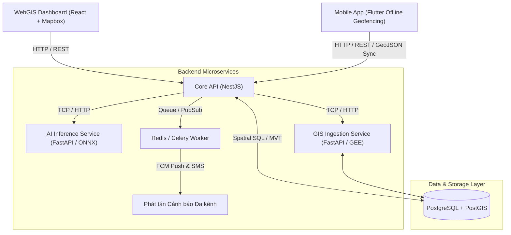

# GeoSentry (TerraWatch) - Hệ Thống Phát Hiện & Cảnh Báo Sạt Lở Đất Từ Ảnh Vệ Tinh

> **Đồ án Tốt nghiệp Kỹ sư Phần mềm (SE Capstone Project)**  
> Ứng dụng công nghệ Viễn thám (Sentinel-2, Landsat-8), Trí tuệ nhân tạo (DeepLabV3+/U-Net) và Hệ thông tin địa lý (PostGIS, Mapbox WebGIS, Flutter Mobile Offline Geofencing).

---

## 🏗️ Kiến Trúc Hệ Thống (Microservices Architecture)

Hệ thống được thiết kế theo mô hình **Modular Monorepo Microservices**, gồm các dịch vụ chuyên biệt:



---

## 👥 Phân Chia Vai Trò Dự Án (WBS)

| Thành viên | Vai trò | Trách nhiệm chính | Thư mục đảm nhiệm |
| :--- | :--- | :--- | :--- |
| **Thành viên 1** | **AI Engineer** | Huấn luyện U-Net/DeepLabV3+ (Landslide4Sense), đóng gói ONNX, tối ưu IoU/F1 | `services/ai-service/` |
| **Thành viên 2** | **GIS Data Engineer** | Pipeline GEE/Sentinel Hub, Cloud masking, NDVI/Slope, Vector Tile (MVT) | `services/gis-service/` |
| **Thành viên 3** | **Backend Engineer** | Core API (NestJS), quản lý Celery/Redis, JWT/RBAC, FCM Push Alert | `services/core-api/` |
| **Thành viên 4** | **Frontend WebGIS** | Dashboard ReactJS + Mapbox GL, bản đồ so sánh vệ tinh, hàng đợi thẩm định | `apps/webgis/` |
| **Thành viên 5** | **Mobile Engineer** | Flutter App, Geofencing chạy ngầm offline (SQLite), báo cáo hiện trường | `apps/mobile/` |

---

## 📁 Cấu Trúc Mã Nguồn (Repository Layout)

```
SECapstone/
├── .agents/                      # Cấu hình AI Agent: 46 BMAD skills & Ponytail rules
│   ├── rules/
│   │   └── ponytail.md           # Quy tắc "Lazy Senior Dev" (YAGNI, minimal code)
│   └── skills/                   # BMAD Method & Ponytail skills
├── .agent/                       # Cấu hình IDE Agent
├── .github/                      # CI/CD Workflows & Copilot instructions
│   └── workflows/
│       ├── ci-core-api.yml       # Path-based CI cho NestJS Core API
│       ├── ci-ai-service.yml     # Path-based CI cho FastAPI AI Service
│       └── ci-webgis.yml         # Path-based CI cho WebGIS Frontend
├── database/                     # CSDL Địa không gian PostGIS
│   ├── init.sql                  # DDL, Trigger tự động tính diện tích m2 & Centroid
│   └── seed.sql                  # Dữ liệu mẫu khu vực Mù Cang Chải
├── services/
│   ├── core-api/                 # NestJS Core Backend (Auth, Thẩm định, Cảnh báo)
│   ├── ai-service/               # FastAPI Deep Learning Landslide Inference
│   └── gis-service/              # FastAPI GIS Pipeline (Sentinel-2, NDVI, MVT)
├── apps/
│   ├── webgis/                   # ReactJS + Mapbox GL Dashboard cho cán bộ
│   └── mobile/                   # Flutter App cho người dân (Geofencing ngoại tuyến)
├── docs/                         # Tài liệu kiến trúc & hướng dẫn quản trị GitHub
│   └── microservices-setup-guide.md
├── docker-compose.yml            # Khởi chạy toàn bộ hệ thống bằng 1 lệnh
├── .env.example                  # Mẫu biến môi trường
└── README.md
```

---

## 🚀 Hướng Dẫn Chạy Nhanh (Local Development)

### 1. Yêu cầu tiên quyết
- [Docker](https://www.docker.com/) & Docker Compose
- [Node.js 20+](https://nodejs.org/) & [Python 3.11+](https://www.python.org/)

### 2. Khởi động toàn bộ Microservices qua Docker Compose
```bash
# 1. Tạo file cấu hình môi trường
cp .env.example .env

# 2. Khởi chạy PostGIS, Redis, Core API, AI Service, GIS Service, WebGIS
docker-compose up -d --build
```

Sau khi khởi chạy:
- **WebGIS Dashboard**: [http://localhost:5173](http://localhost:5173)
- **Core API Swagger/Health**: [http://localhost:3000](http://localhost:3000)
- **AI Inference Service Docs**: [http://localhost:8001/docs](http://localhost:8001/docs)
- **GIS Pipeline Service Docs**: [http://localhost:8002/docs](http://localhost:8002/docs)
- **PostGIS Database**: `localhost:5432` (`postgres:postgrespassword`, db: `terrawatch`)

---

## 🧠 Tích Hợp BMAD Method & Ponytail

Dự án đã tích hợp sẵn:
1. **BMAD Framework** (Breakthrough Method of Agile AI-Driven Development):
   - Cung cấp 46 skills hỗ trợ phát triển: thiết kế PRD, kiến trúc, chia nhỏ Epic & User Story, Code review.
   - Thư mục quản trị: `_bmad/` và `.agents/skills/`.
2. **Ponytail Rule & Skill**:
   - Chế độ "Lazy Senior Developer" tại [.agents/rules/ponytail.md](file:///.agents/rules/ponytail.md).
   - Triết lý cốt lõi: *"The best code is the code you never wrote"*, ngăn ngừa over-engineering, loại bỏ boilerplate dư thừa, tối ưu chi phí token và hiệu năng runtime.

---

## 📖 Hướng Dẫn Quản Trị GitHub Repo

Xem hướng dẫn chi tiết về Branching Strategy, Branch Protection, Path-based CI/CD tại:  
👉 [docs/microservices-setup-guide.md](file:///docs/microservices-setup-guide.md)
