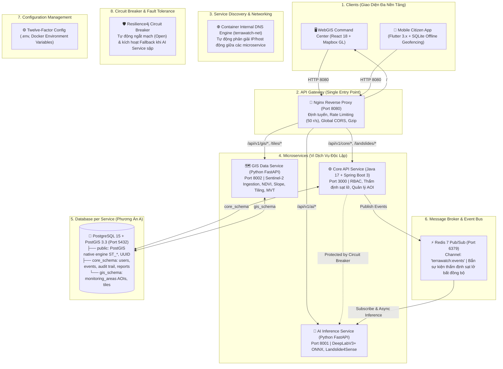

<div align="center">

# 🛰️ GEOSENTRY (TERRAWATCH)
### HỆ THỐNG PHÁT HIỆN & CẢNH BÁO SẠT LỞ ĐẤT VIỄN THÁM ĐA PHÂN HỆ
**Đồ Án Tốt Nghiệp Kỹ Sư Phần Mềm (Software Engineering Capstone Project)**

[](.github/workflows/ci-core-api.yml)
[](.github/workflows/ci-ai-service.yml)
[](.github/workflows/ci-webgis.yml)
[](docker-compose.yml)
[](gateway)
[](services/core-api)
[](LICENSE)

<br/>

[Tổng Quan](#-tổng-quan-đề-tài) • 
[Kiến Trúc Microservices 8 Thành Phần](#-kiến-trúc-hệ-thống-chuẩn-8-thành-phần-cốt-lõi) • 
[Cấu Trúc Thư Mục](#-cấu-trúc-chi-tiết-toàn-bộ-dự-án) • 
[Kiến Trúc CSDL & Migrations](#-kiến-trúc-csdl-schema-per-service--migrations) • 
[Cách Chạy Dự Án](#-hướng-dẫn-chạy-dự-án-chi-tiết) • 
[Tài Liệu Kỹ Thuật](#-tài-liệu-kỹ-thuật)

</div>

---

## 📌 Tổng Quan Đề Tài

Hệ thống **GeoSentry (TerraWatch)** là giải pháp công nghệ viễn thám và trí tuệ nhân tạo toàn diện nhằm giám sát và cảnh báo sớm thiên tai trượt lở đất tại các tỉnh miền núi phía Bắc Việt Nam (Yên Bái, Lào Cai, Hà Giang).

Hệ thống hoạt động theo quy trình **bán tự động (Semi-automated)**:
1. **Thu thập**: Vệ tinh Sentinel-2 quang học đa phổ độ phân giải 10m quét định kỳ.
2. **Tiền xử lý & AI**: Lọc mây, tính toán chỉ số $\Delta\text{NDVI}$ và độ dốc (Slope), cắt ảnh thành các patch để mô hình DeepLabV3+/U-Net (Landslide4Sense) phân đoạn nhận diện.
3. **Thẩm định**: Cán bộ chuyên môn kiểm tra hàng đợi trên WebGIS Dashboard và phê duyệt.
4. **Phát tán đa kênh**: Kích hoạt gửi thông báo khẩn qua FCM Push, SMS, và đặc biệt hỗ trợ **Geofencing ngoại tuyến trên ứng dụng di động** (rung chuông báo động ngay cả khi mất sóng 4G/Internet).

---

## 🏛️ Kiến Trúc Hệ Thống: Chuẩn 8 Thành Phần Cốt Lõi

Hệ thống hiện thực hóa đầy đủ **8 thành phần cốt lõi của một hệ thống Microservices công nghiệp**:



### Bảng Đối Soát 8 Thành Phần Cốt Lõi:

| STT | Thành phần cốt lõi | Hiện thực hóa trong TerraWatch | Công nghệ |
| :---: | :--- | :--- | :--- |
| **1** | **Client (Web, Mobile)** | WebGIS Command Center & Mobile App Offline Geofencing | React 18, Mapbox GL JS, Flutter 3.x, SQLite |
| **2** | **API Gateway** | Điểm vào duy nhất (Port 8080): định tuyến, Rate Limiting (50 req/s), CORS, Gzip | Nginx Reverse Proxy (`gateway/`) |
| **3** | **Service Discovery** | Định danh và phân giải địa chỉ động qua tên container nội bộ | Docker Container Internal DNS (`terrawatch-net`) |
| **4** | **Microservices (Vi dịch vụ)** | Các service độc lập theo chuẩn Bounded Context (Core API, AI Service, GIS Service) | Java 17 Spring Boot 3, Python 3.11 FastAPI |
| **5** | **Database per Service** | Phân chia Logical Schema-per-Service đảm bảo cô lập dữ liệu và tối ưu PostGIS | PostgreSQL 15, PostGIS 3.3 (`core_schema`, `gis_schema`) |
| **6** | **Message Broker / Event Bus** | Kênh giao tiếp bất đồng bộ, phát tán sự kiện thẩm định sạt lở | Redis 7 Alpine Pub/Sub (`terrawatch:events`) |
| **7** | **Configuration Management** | Quản lý cấu hình tập trung theo chuẩn Twelve-Factor App | Biến môi trường `.env`, Docker Compose Config Profiles |
| **8** | **Circuit Breaker / Resilience** | Ngắt mạch tự động chống sập lan truyền khi AI/GIS service gặp sự cố | Resilience4j Spring Boot 3 (`@CircuitBreaker`) |

---

## 📁 Cấu Trúc Chi Tiết Toàn Bộ Dự Án

```
SECapstone/
├── .agents/                               # Bộ kỹ năng AI Agentic: 46 BMAD skills & Ponytail rules
├── .github/workflows/                     # Path-based CI/CD độc lập từng service (Core API, AI, WebGIS)
├── gateway/                               # [API Gateway] Điểm vào duy nhất của toàn hệ thống (Port 8080)
│   ├── nginx.conf                         # Reverse proxy routing, Rate Limiting, Global CORS, Gzip
│   └── Dockerfile                         # Nginx 1.25 Alpine
├── database/                              # Quản lý CSDL Địa không gian PostGIS
│   ├── init.sql                           # DDL Schema-per-Service (core_schema, gis_schema), Triggers, Views
│   ├── seed.sql                           # Dữ liệu kiểm thử mẫu (Yên Bái, Lào Cai, Hà Giang)
│   └── migrations/                        # Các bản migration đánh số tuần tự (Flyway format)
│       ├── V1__init_postgis_schema.sql
│       └── V2__seed_vietnam_geospatial_data.sql
├── services/
│   ├── core-api/                          # [Java 17 + Spring Boot 3] Core Backend Service (Port 3000)
│   │   ├── pom.xml                        # Maven: Spring Data JPA, Security 6, Resilience4j, Redis, Flyway
│   │   ├── Dockerfile                     # Multi-stage build (Maven 3.9 + Temurin 17 JRE)
│   │   └── src/main/java/vn/terrawatch/core/
│   │       ├── client/                    # Clients gọi liên service bọc bởi Resilience4j Circuit Breaker
│   │       │   ├── AiServiceClient.java   # @CircuitBreaker(name = "aiService") + Fallback
│   │       │   └── GisServiceClient.java  # @CircuitBreaker(name = "gisService") + Fallback
│   │       ├── event/                     # Message Broker / Event Bus (Redis Pub/Sub)
│   │       │   ├── EventPublisher.java    # Bắn sự kiện lên channel "terrawatch:events"
│   │       │   └── TerraWatchEvent.java   # Mẫu message chuẩn
│   │       ├── controller/                # REST Controllers (Landslides, Areas, Reports, Diagnostic)
│   │       ├── entity/                    # JPA Entities (@Table(schema = "core_schema" / "gis_schema"))
│   │       ├── repository/                # JpaRepositories + SpatialRepository (Native PostGIS)
│   │       └── service/                   # Logic nghiệp vụ
│   ├── ai-service/                        # [Python 3.11 + FastAPI] AI Inference Service (Port 8001)
│   │   ├── app/
│   │   │   ├── main.py                    # Endpoints & Startup event listener
│   │   │   └── services/
│   │   │       ├── inference.py           # DeepLabV3+ ONNX Inference
│   │   │       └── event_listener.py      # Lắng nghe sự kiện bất đồng bộ từ Redis Event Bus
│   │   ├── requirements.txt
│   │   └── Dockerfile
│   └── gis-service/                       # [Python 3.11 + FastAPI] GIS Data Pipeline Service (Port 8002)
│       ├── app/
│       │   ├── main.py                    # Endpoints: /api/v1/gis/query-satellite, /tiling, /tiles
│       │   └── pipeline/processor.py      # Tính toán NDVI, Slope, Cắt ảnh Tiling
│       ├── requirements.txt
│       └── Dockerfile
├── apps/
│   ├── webgis/                            # [React 18 + Vite] Dashboard Cán Bộ Thẩm Định
│   └── mobile/                            # [Flutter 3.x] Ứng Dụng Di Động Dành Cho Người Dân
├── docs/                                  # Bộ tài liệu kỹ thuật hoàn chỉnh
│   ├── ARCHITECTURE.md                    # Tài liệu kiến trúc C4 Model & 8 thành phần Microservices
│   ├── AI_MODEL_CARD.md                   # Hồ sơ nghiên cứu mô hình AI (Landslide4Sense Benchmark)
│   └── microservices-setup-guide.md       # Hướng dẫn thiết lập repo, quy ước Git và CI/CD
├── scripts/
│   └── migrate.py                         # Tool CLI Migration CSDL dùng chung (như Prisma migrate)
├── docker-compose.yml                     # File điều phối khởi chạy toàn bộ 7 services
├── Makefile                               # Bộ phím tắt điều hành dự án 1 lệnh & demo Circuit Breaker/Event Bus
└── .env.example                           # Mẫu cấu hình biến môi trường
```

---

## 🗄️ Kiến Trúc CSDL (Schema-per-Service) & Migrations

### 1. Kiến trúc CSDL: Logical Schema-per-Service (Phương án A)
Nhằm đảm bảo ranh giới dữ liệu độc lập giữa các Microservices nhưng vẫn tận dụng được sức mạnh tính toán hình học native của PostGIS (0ms network latency), hệ thống chia tách CSDL thành các schema logic:
- **`public`**: Chứa extension `postgis`, `uuid-ossp`, và bảng kiểm soát migration `public.schema_migrations`.
- **`core_schema`**: Dành riêng cho **Core API (Java Spring Boot 3)**, gồm: `users`, `landslide_events`, `landslide_event_history`, `community_reports`, `v_active_landslide_zones`.
- **`gis_schema`**: Dành riêng cho **GIS Data Service (Python FastAPI)**, gồm: `monitoring_areas` (AOIs), siêu dữ liệu phân mảnh ảnh vệ tinh.

### 2. Hai Cơ Chế Database Migrations Song Hành

```bash
# 1. Chạy tất cả các bản migration mới nhất (Tương đương 'npx prisma migrate dev')
make migrate
# hoặc: python scripts/migrate.py up

# 2. Xem trạng thái các bản migration (Đã chạy hay đang chờ)
make db-status
# hoặc: python scripts/migrate.py status

# 3. Nạp lại dữ liệu mẫu kiểm thử
make seed
```

---

## 🚀 Hướng Dẫn Chạy Dự Án Chi Tiết

### CÁCH 1: Khởi Chạy 1 Lệnh Bằng Docker Compose (Khuyên dùng khi Demo & Chấm Điểm)

Toàn bộ 7 thành phần (PostGIS, Redis, Core API, AI Service, GIS Service, WebGIS, API Gateway) sẽ được khởi tạo tự động:

```bash
# Bước 1: Sao chép file cấu hình môi trường
cp .env.example .env

# Bước 2: Khởi động toàn bộ hệ thống
make up
# hoặc: docker-compose up -d --build

# Bước 3: Xem log hệ thống đang chạy
make logs

# Bước 4: Kiểm tra trạng thái các containers
make ps

# Bước 5: Thử nghiệm các tính năng nâng cao (Demo buổi bảo vệ)
make demo-circuit-breaker  # Thử nghiệm Circuit Breaker Resilience4j
make demo-event-bus        # Thử nghiệm Message Broker Redis Event Bus
```

---

## 🌐 Danh Mục Cổng Dịch Vụ & API Gateway Routing

Sau khi khởi chạy, **toàn bộ hệ thống có thể truy cập thông qua API Gateway duy nhất tại cổng `8080`**:

| Dịch Vụ | Cổng Trực Tiếp | Cổng Đi Qua Gateway (Khuyên Dùng) | Tài liệu tương tác / Swagger |
| :--- | :---: | :---: | :--- |
| **API Gateway** | `8080` | **`http://localhost:8080`** | Điểm vào duy nhất cho mọi client |
| **WebGIS Dashboard** | `5173` | [http://localhost:8080](http://localhost:8080) | Giao diện điều hành trực quan |
| **Core API** | `3000` | [http://localhost:8080/api/v1/core](http://localhost:8080/api/v1/core) | [http://localhost:8080/swagger-ui/index.html](http://localhost:8080/swagger-ui/index.html) |
| **AI Service** | `8001` | [http://localhost:8080/api/v1/ai](http://localhost:8080/api/v1/ai) | [http://localhost:8001/docs](http://localhost:8001/docs) |
| **GIS Service** | `8002` | [http://localhost:8080/api/v1/gis](http://localhost:8080/api/v1/gis) | [http://localhost:8002/docs](http://localhost:8002/docs) |
| **PostGIS Database** | `5432` | `localhost:5432` | `terrawatch` (user: `postgres`) |
| **Redis Event Bus** | `6379` | `localhost:6379` | Channel: `terrawatch:events` |

---

## 👥 Phân Công Vai Trò WBS (Work Breakdown Structure)

| Thành viên | Vai trò | Trách nhiệm chính | Thư mục đảm nhiệm |
| :---: | :--- | :--- | :--- |
| **Thành viên 1** | **AI Engineer** | Huấn luyện mô hình DeepLabV3+/U-Net trên dataset Landslide4Sense, tối ưu F1=0.768, IoU=0.642, đóng gói ONNX Runtime, Redis Event Listener. | [`services/ai-service/`](services/ai-service) |
| **Thành viên 2** | **GIS Data Engineer** | Xây dựng pipeline GEE/Sentinel Hub, lọc mây, tính toán chỉ số $\Delta\text{NDVI}$, độ dốc (Slope), cắt ảnh (Tiling), Vector Tile MVT. | [`services/gis-service/`](services/gis-service) |
| **Thành viên 3** | **Backend Engineer** | Thiết kế kiến trúc Microservices, Core API (Java Spring Boot 3), bảo mật Spring Security, Resilience4j Circuit Breaker, Redis Event Bus, Flyway. | [`services/core-api/`](services/core-api) |
| **Thành viên 4** | **Frontend WebGIS** | Xây dựng Dashboard ReactJS, tích hợp Mapbox GL JS, bản đồ so sánh đa thời gian, quản lý hàng đợi thẩm định, kết nối qua API Gateway. | [`apps/webgis/`](apps/webgis), [`gateway/`](gateway) |
| **Thành viên 5** | **Mobile Engineer** | Ứng dụng di động Flutter, thuật toán Geofencing ngoại tuyến (Haversine & Ray Casting), SQLite cache $\ge 10,000$ điểm. | [`apps/mobile/`](apps/mobile) |

---

## 📚 Tài Liệu Kỹ Thuật

- 📘 [Tài Liệu Thiết Kế Kiến Trúc Phần Mềm C4 Model (docs/ARCHITECTURE.md)](docs/ARCHITECTURE.md)
- 🤖 [Đặc Tả Kỹ Thuật Mô Hình Trí Tuệ Nhân Tạo (docs/AI_MODEL_CARD.md)](docs/AI_MODEL_CARD.md)
- ⚙️ [Hướng Dẫn Quản Trị Microservices, Circuit Breaker & Event Bus (docs/microservices-setup-guide.md)](docs/microservices-setup-guide.md)
- 🤝 [Quy Chuẩn Đóng Góp & Commit (CONTRIBUTING.md)](CONTRIBUTING.md)
- 🗃️ [Kịch Bản Khởi Tạo CSDL PostGIS](database/init.sql)
- 📋 [Tài Liệu Yêu Cầu & Thiết Kế Gốc](Tai_Lieu_Yeu_Cau_Va_Thiet_Ke_He_Thong_Canh_Bao_Sat_Lo_Dat.docx)
