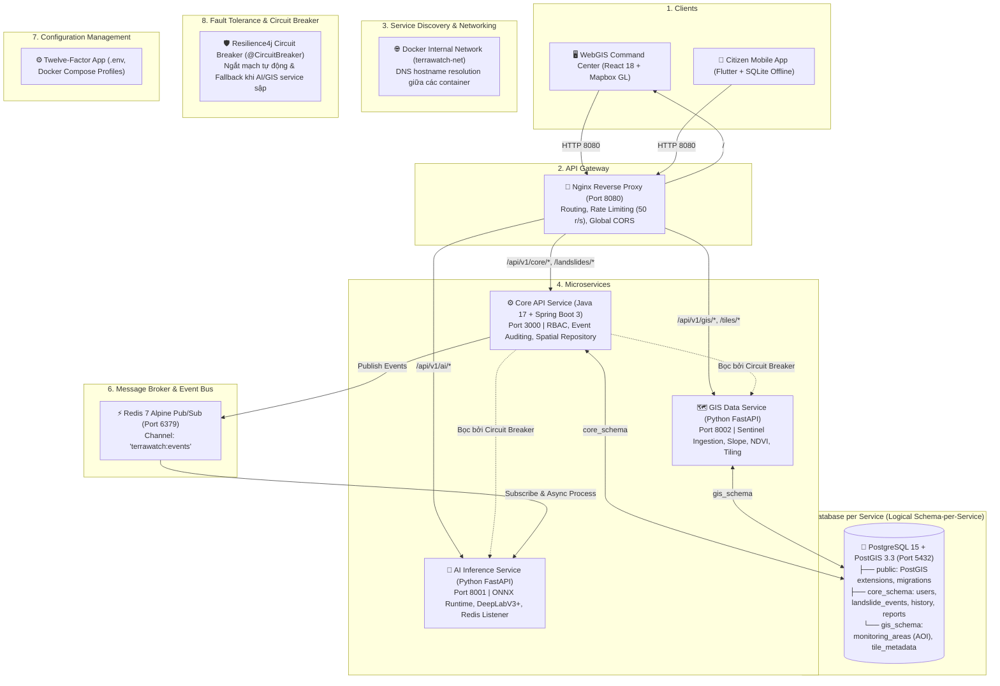

# System Architecture Document (SAD)
## Project: GeoSentry (TerraWatch) Microservices Architecture

**Version:** 1.0.0  
**Date:** 2026-10-02  
**Architect:** Winston (System Architect)  
**Standard:** C4 Model & 8 Core Microservices Principles

---

### 1. Kiến Trúc Tổng Thể: 8 Thành Phần Cốt Lõi



---

### 2. Ranh Giới Dữ Liệu: Logical Schema-per-Service (PostGIS)

Hệ thống triển khai mô hình **Schema-per-Service** trên cùng một instance PostgreSQL 15 + PostGIS 3.3 nhằm cô lập dữ liệu nghiệp vụ nhưng vẫn tận dụng được engine tính toán hình học 0ms latency:

1. **`core_schema` (Thuộc quyền sở hữu của Core API - Spring Boot 3):**
   - `users`: Tài khoản cán bộ, phân quyền RBAC (`ADMIN`, `DISASTER_OFFICER`, `COMMUNITY_LEADER`).
   - `landslide_events`: Điểm và đa giác sạt lở (`geometry(MultiPolygon, 4326)`), mức độ rủi ro, trạng thái thẩm định (`PENDING`, `VERIFIED`, `REJECTED`).
   - `landslide_event_history`: Bảng vết kiểm toán (Audit Trail) ghi lại lịch sử thay đổi trạng thái và người phê duyệt.
   - `community_reports`: Phản ánh sạt lở từ người dân ngoài hiện trường kèm tọa độ GPS và URL ảnh.
   - `v_active_landslide_zones`: View không gian tối ưu cho WebGIS và Mobile tải về.

2. **`gis_schema` (Thuộc quyền sở hữu của GIS Data Service - Python FastAPI):**
   - `monitoring_areas`: Khu vực giám sát trọng điểm (AOI - Bounding Box đa giác EPSG:4326).
   - `satellite_scenes`: Siêu dữ liệu ảnh vệ tinh Sentinel-2 (Scene ID, ngày chụp, % mây, đường dẫn lưu trữ raster).
   - `raster_tiles`: Thông tin phân mảnh tile $128 \times 128$ phục vụ suy luận AI.

3. **Chỉ mục không gian (Spatial Indexes):**
   - Mọi cột kiểu `geometry` bắt buộc phải có chỉ mục `USING GIST (geom)`.

---

### 3. Quy Chuẩn Giao Tiếp Liên Dịch Vụ (Inter-Service Protocols)

1. **Đồng bộ (Synchronous - REST via Circuit Breaker):**
   - Client gọi vào API Gateway Nginx (`http://localhost:8080`).
   - Core API gọi sang AI Service hoặc GIS Service thông qua RestTemplate / WebClient có cấu hình `@CircuitBreaker(name = "aiService", fallbackMethod = "aiFallback")`.
2. **Bất đồng bộ (Asynchronous - Event Bus via Redis Pub/Sub):**
   - Channel duy nhất: `terrawatch:events`.
   - Cấu trúc thông điệp JSON:
     ```json
     {
       "eventId": "uuid-v4",
       "eventType": "LANDSLIDE_DETECTED | LANDSLIDE_VERIFIED | SATELLITE_INGESTED",
       "timestamp": "2026-10-02T14:00:00Z",
       "payload": { ... }
     }
     ```

---

### 4. Định Tuyến API Gateway (Nginx)

| Route Pattern | Target Upstream | Chức năng |
| :--- | :--- | :--- |
| `/api/v1/core/*` | `http://core-api:3000` | Quản trị, thẩm định, người dùng, báo cáo |
| `/api/v1/ai/*` | `http://ai-service:8001` | Trực tiếp suy luận AI hoặc kiểm tra model |
| `/api/v1/gis/*` | `http://gis-service:8002` | Kéo dữ liệu vệ tinh, cắt tile, query DEM |
| `/tiles/*` | `http://gis-service:8002` | Vector/Raster Tiles cho WebGIS |
| `/` | `http://webgis:80` | Frontend WebGIS Single Page Application |
