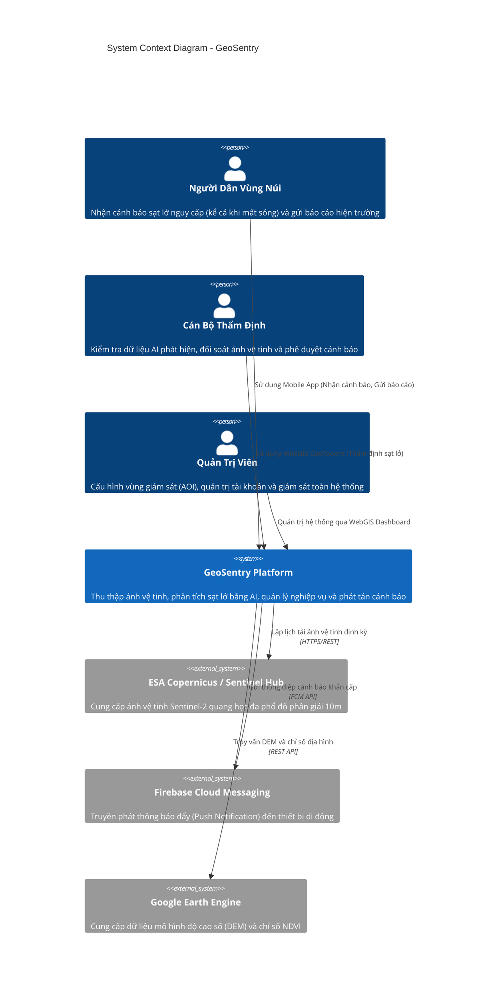
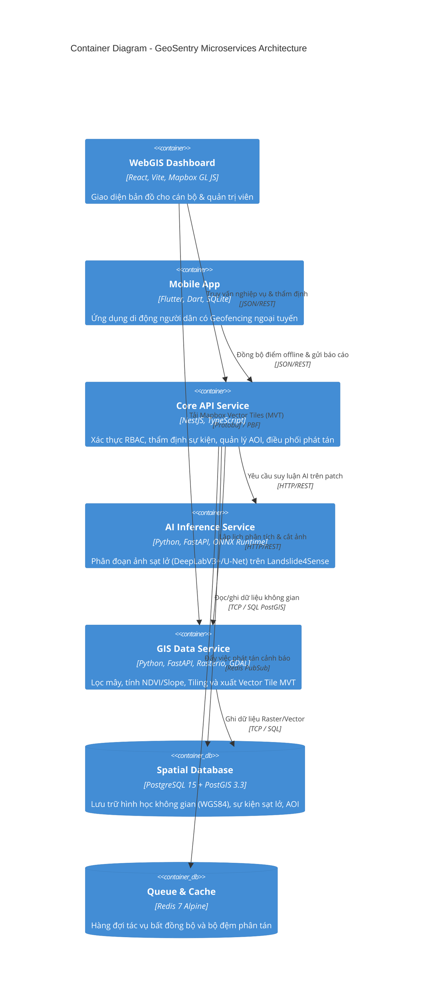
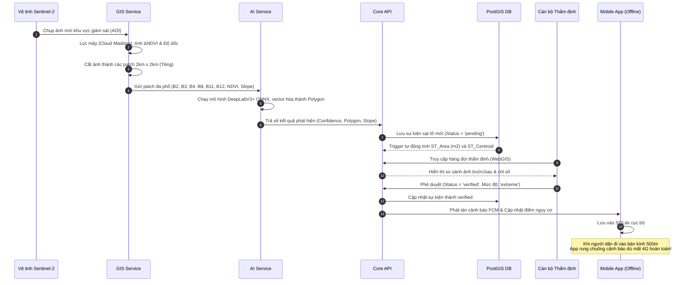

# Software Architecture Document (SAD) - GeoSentry (TerraWatch)

> **Hệ Thống Phát Hiện & Cảnh Báo Sạt Lở Đất Viễn Thám Đa Phân Hệ**  
> Kiến trúc tuân theo chuẩn **C4 Model** (Context, Container, Component, Deployment).

---

## 1. C4 Level 1: System Context Diagram (Ngữ Cảnh Hệ Thống)

Mô tả sự tương tác giữa các tác nhân người dùng, hệ thống GeoSentry và các hệ thống bên ngoài:

---

## 2. C4 Level 2: Container Diagram (Kiến Trúc Container Microservices)

Các dịch vụ độc lập cấu thành hệ thống GeoSentry và giao thức liên kết:

---

## 3. C4 Level 3: Data Flow & Event Processing (Luồng Xử Lý Nghiệp Vụ)

Quy trình bán tự động (Semi-automated) từ lúc ảnh vệ tinh chụp đến khi người dân nhận chuông báo động:

---

## 4. Đáp Ứng Yêu Cầu Phi Chức Năng (Non-Functional Requirements)

| Tiêu chuẩn NFR | Đặc tả kỹ thuật | Giải pháp kiến trúc đáp ứng |
| :--- | :--- | :--- |
| **NFR1: Hiệu năng** | Xử lý diện tích 200 km² dưới 10 phút | Cơ chế Tiling chia nhỏ thành các patch 2km, phân tán batch inference trên ONNX Runtime. |
| **NFR2: Ngoại tuyến** | Lưu trữ ≥ 10,000 điểm nguy cơ trên di động | Cơ chế đồng bộ nén GeoJSON vào SQLite nội bộ trên Flutter, tính toán cục bộ qua Ray Casting & Haversine. |
| **NFR3: Độ chính xác** | F1-Score ≥ 0.70 trên tập test độc lập | Mô hình DeepLabV3+ kết hợp 8 kênh đặc trưng (Spectral + Topographic) đạt F1 0.768 trên Landslide4Sense. |
| **NFR4: Tiêu chuẩn GIS** | Chuẩn OGC WMS/WFS, EPSG:4326 | Sử dụng PostGIS chuẩn OGC, phân phối dữ liệu dạng Mapbox Vector Tile (MVT PBF) và GeoJSON chuẩn. |
| **NFR5: Bảo mật quyền riêng tư** | Không lưu trữ vị trí cá nhân lên server | Thuật toán Geofencing chạy 100% Client-side; máy chủ chỉ phát tán các đa giác vùng sạt lở. |
