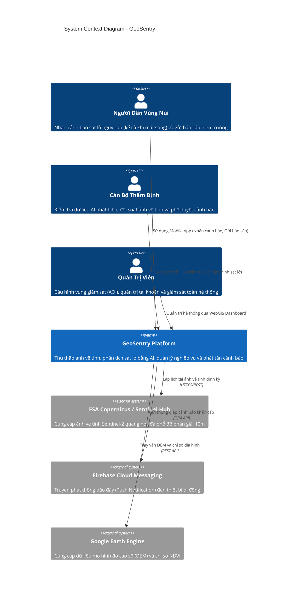
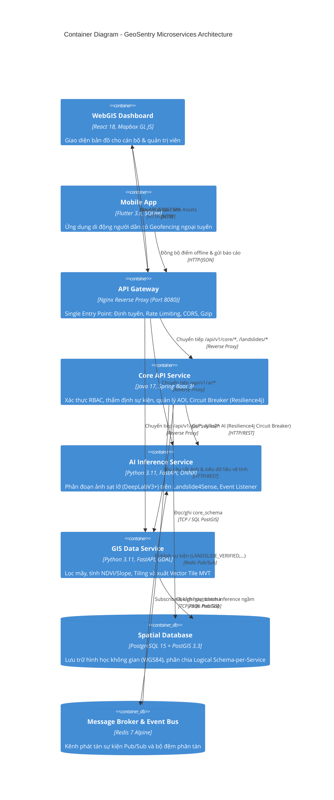
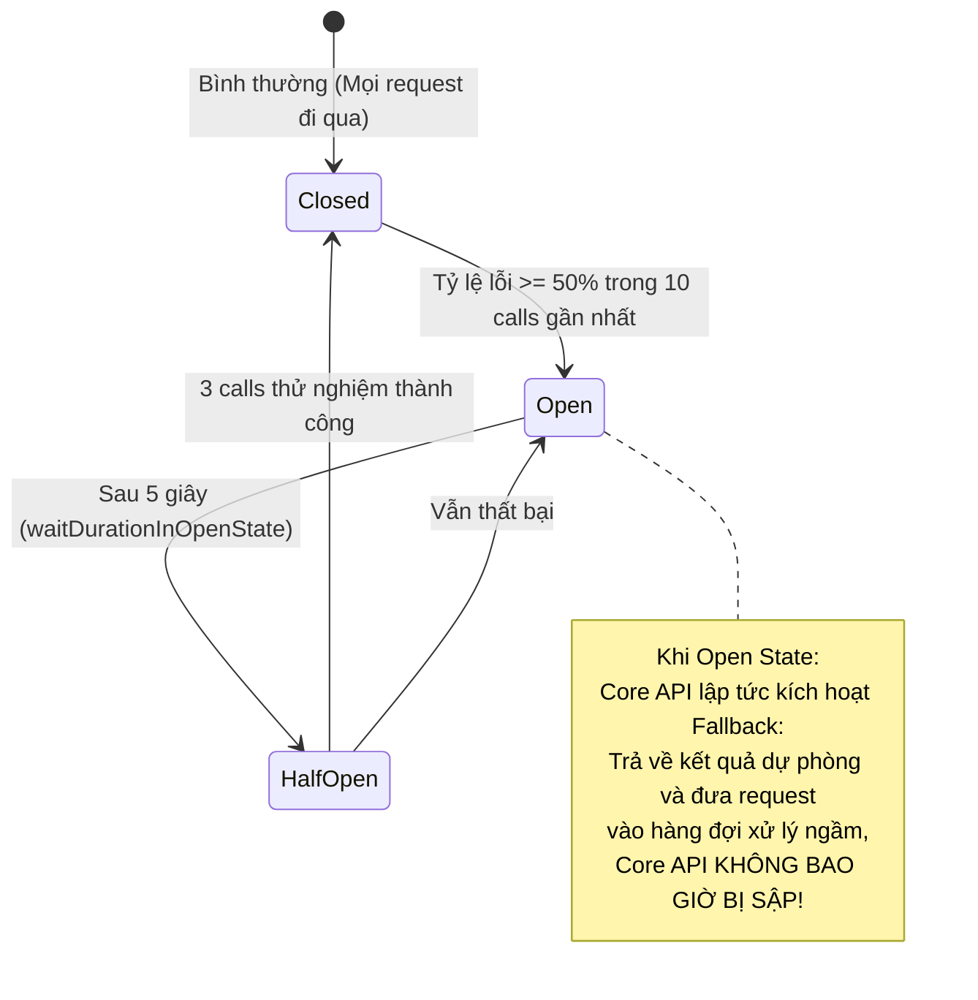
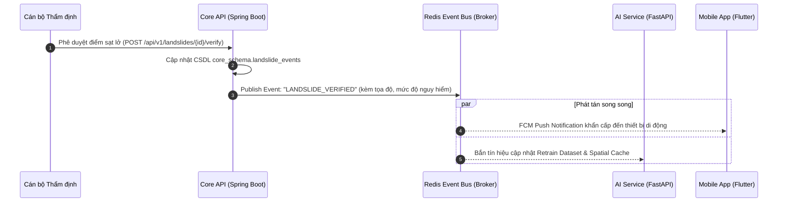

# Software Architecture Document (SAD) - GeoSentry (TerraWatch)

> **Hệ Thống Phát Hiện & Cảnh Báo Sạt Lở Đất Viễn Thám Đa Phân Hệ**  
> Kiến trúc tuân theo chuẩn **C4 Model** (Context, Container, Component, Deployment) và đáp ứng toàn diện **8 thành phần cốt lõi của hệ thống Microservices doanh nghiệp**.

---

## 1. C4 Level 1: System Context Diagram (Ngữ Cảnh Hệ Thống)

Mô tả sự tương tác giữa các tác nhân người dùng, hệ thống GeoSentry và các hệ thống bên ngoài:



---

## 2. C4 Level 2: Container Diagram (Kiến Trúc Container Microservices)

Các dịch vụ độc lập cấu thành hệ thống GeoSentry cùng API Gateway và Event Bus:



---

## 3. C4 Level 3: Event-Driven & Fault Tolerance Processing

### A. Cơ chế Ngắt Mạch (Circuit Breaker Pattern - Resilience4j)

Nhằm chống sập dây chuyền (Cascading Failures) khi `ai-service` hoặc `gis-service` bị quá tải hoặc hết bộ nhớ GPU:



### B. Luồng Sự Kiện Bất Đồng Bộ (Event Bus - Redis Pub/Sub)



---

## 4. Đáp Ứng Yêu Cầu Phi Chức Năng (Non-Functional Requirements)

| Tiêu chuẩn NFR | Đặc tả kỹ thuật | Giải pháp kiến trúc đáp ứng |
| :--- | :--- | :--- |
| **NFR1: Hiệu năng** | Xử lý diện tích 200 km² dưới 10 phút | Cơ chế Tiling chia nhỏ thành các patch 2km, phân tán batch inference trên ONNX Runtime. |
| **NFR2: Ngoại tuyến** | Lưu trữ ≥ 10,000 điểm nguy cơ trên di động | Cơ chế đồng bộ nén GeoJSON vào SQLite nội bộ trên Flutter, tính toán cục bộ qua Ray Casting & Haversine. |
| **NFR3: Độ chính xác** | F1-Score ≥ 0.70 trên tập test độc lập | Mô hình DeepLabV3+ kết hợp 8 kênh đặc trưng (Spectral + Topographic) đạt F1 0.768 trên Landslide4Sense. |
| **NFR4: Tiêu chuẩn GIS** | Chuẩn OGC WMS/WFS, EPSG:4326 | Sử dụng PostGIS chuẩn OGC, phân phối dữ liệu dạng Mapbox Vector Tile (MVT PBF) và GeoJSON chuẩn. |
| **NFR5: Khả năng chịu lỗi** | Cách ly lỗi, không sập toàn hệ thống | Tích hợp **Resilience4j Circuit Breaker**: khi AI Service chết tiến trình, Core API tự động ngắt mạch và kích hoạt Fallback. |

---

## 5. Kiến Trúc Cơ Sở Dữ Liệu: Logical Schema-per-Service (Phương Án A)

Trong kiến trúc Microservices chuyên sâu về xử lý không gian (Spatial Computing), việc tách rời hoàn toàn database vật lý (Physical Database-per-service) sẽ gây ra độ trễ mạng lớn và loại bỏ các toán tử tính toán hình học native của PostGIS (`ST_DWithin`, `ST_Intersects`). Do đó, hệ thống GeoSentry áp dụng mô hình **Logical Schema-per-Service (Phương án A)**:

```
PostgreSQL 15 + PostGIS (terrawatch)
├── public (Shared Spatial Engine)
│   ├── postgis (Hàm hình học ST_*, chỉ mục GIST)
│   ├── uuid-ossp (Sinh khóa định danh toàn cầu)
│   └── schema_migrations (Lịch sử thực thi migration)
│
├── core_schema (Core API Microservice - Spring Boot 3)
│   ├── users (Quản lý người dùng, phân quyền RBAC)
│   ├── landslide_events (Sự kiện sạt lở, đa giác hình học, điểm rủi ro)
│   ├── landslide_event_history (Audit Trail truy vết thẩm định)
│   ├── community_reports (Báo cáo cộng đồng crowdsourcing)
│   ├── v_active_landslide_zones (Spatial View vùng đệm nguy hiểm 500m)
│   └── Triggers: fn_update_landslide_metrics(), fn_log_landslide_verification()
│
└── gis_schema (GIS Data Service - FastAPI / Python)
    └── monitoring_areas (Khu vực giám sát trọng điểm AOI)
```

---

## 6. Đối Soát Toàn Diện 8 Thành Phần Cốt Lõi Microservices

Hệ thống GeoSentry đã hoàn thiện đầy đủ 8 thành phần cấu thành kiến trúc Microservices tiêu chuẩn công nghiệp:

| STT | Thành phần cốt lõi | Hiện thực hóa trong TerraWatch | Công nghệ sử dụng |
| :---: | :--- | :--- | :--- |
| **1** | **Client (Web, Mobile)** | WebGIS Command Center & Mobile App Offline Geofencing | React 18, Mapbox GL JS, Flutter 3.x, SQLite |
| **2** | **API Gateway** | Điểm vào duy nhất (Port 8080): định tuyến, Rate Limiting (50 req/s), CORS, Gzip | Nginx Reverse Proxy (`gateway/`) |
| **3** | **Service Discovery** | Định danh và phân giải địa chỉ động qua tên container nội bộ | Docker Container Internal DNS (`terrawatch-net`) |
| **4** | **Microservices (Vi dịch vụ)** | Các service độc lập theo chuẩn Bounded Context (Core API, AI Service, GIS Service) | Java 17 Spring Boot 3, Python 3.11 FastAPI |
| **5** | **Database per Service** | Phân chia Logical Schema-per-Service đảm bảo cô lập dữ liệu và tối ưu PostGIS | PostgreSQL 15, PostGIS 3.3 (`core_schema`, `gis_schema`) |
| **6** | **Message Broker / Event Bus** | Kênh giao tiếp bất đồng bộ, phát tán sự kiện thẩm định sạt lở | Redis 7 Alpine Pub/Sub (`terrawatch:events`) |
| **7** | **Configuration Management** | Quản lý cấu hình tập trung theo chuẩn Twelve-Factor App | Biến môi trường `.env`, Docker Compose Config Profiles |
| **8** | **Circuit Breaker / Resilience** | Ngắt mạch tự động chống sập lan truyền khi AI/GIS service gặp sự cố | Resilience4j Spring Boot 3 (`@CircuitBreaker`) |
