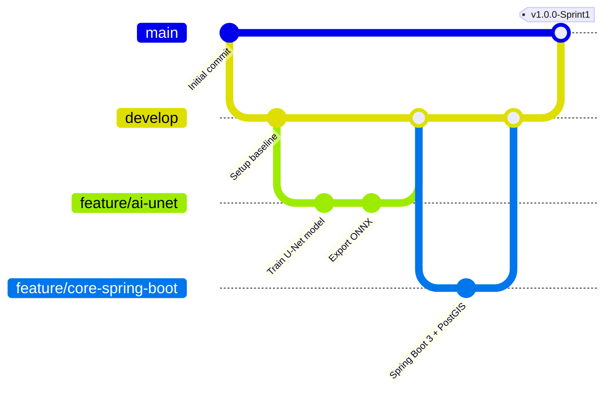

# Hướng Dẫn Thiết Lập & Quản Trị Hệ Thống Microservices (GeoSentry / TerraWatch)

Tài liệu này hướng dẫn chi tiết cách tổ chức, vận hành CSDL và quản trị GitHub repository cho dự án Capstone **GeoSentry** theo kiến trúc Microservices Polyglot.

---

## 1. Lựa Chọn Chiến Lược Repo: Modular Monorepo

### Tại sao chọn Monorepo cho nhóm Capstone (5 người)?
| Tiêu chí | Monorepo (1 Repo duy nhất) | Multi-repo (Mỗi service 1 Repo) |
| :--- | :--- | :--- |
| **Phối hợp nhóm** | **Rất cao**: Cả 5 người nhìn thấy toàn cảnh, dễ review code chéo. | **Thấp**: Rời rạc, khó theo dõi tiến độ tổng thể. |
| **Chạy Local (Docker)** | **1 lệnh**: `docker-compose up` khởi động toàn bộ hệ thống ngay. | Phức tạp: Phải clone 5 repo, liên kết mạng docker thủ công. |
| **Hợp đồng API (Contract)** | Thay đổi DTO/Schema cập nhật đồng bộ trong 1 Pull Request. | Phải tạo PR trên từng repo, dễ lệch phiên bản (drift). |
| **CI/CD** | Dùng **Path-based triggering** (chỉ build service có thay đổi code). | Mỗi repo 1 pipeline riêng nhưng khó test end-to-end liên repo. |

> **Kết luận**: Với nhóm 5 người làm đồ án tốt nghiệp, **Modular Monorepo** là mô hình chuẩn mực nhất: vừa tách biệt độc lập từng service (mỗi service có Dockerfile, pom.xml / requirements.txt riêng), vừa dùng chung một repository trên GitHub.

---

## 2. Thiết Lập Nhánh & Quản Trị Git (Branching Strategy)

Áp dụng mô hình **GitFlow rút gọn (Trunk-based with Feature Branches)**:



### Quy ước đặt tên nhánh theo WBS:
- `feature/ai-<tên_tính_năng>`: Dành cho Thành viên 1 (AI Engineer)
- `feature/gis-<tên_tính_năng>`: Dành cho Thành viên 2 (GIS Engineer)
- `feature/core-<tên_tính_năng>`: Dành cho Thành viên 3 (Backend Engineer - Java Spring Boot)
- `feature/webgis-<tên_tính_năng>`: Dành cho Thành viên 4 (Frontend WebGIS)
- `feature/mobile-<tên_tính_năng>`: Dành cho Thành viên 5 (Mobile Engineer)

---

## 3. Cấu Hình Branch Protection Rules Trên GitHub

1. Vào **Settings** -> **Branches** -> Chọn **Add branch protection rule**.
2. Áp dụng cho nhánh `main` và `develop`:
   - ☑️ **Require a pull request before merging** (Bắt buộc tạo PR, không push thẳng lên `main`).
   - ☑️ **Require approvals**: Tối thiểu 1 phê duyệt (Approved) từ đồng đội.
   - ☑️ **Require status checks to pass before merging**: Chọn các checks tương ứng (`CI - Core API (Spring Boot 3)`, `CI - AI Service`, `CI - WebGIS`).
   - ☑️ **Require conversation resolution before merging**: Bắt buộc giải quyết hết comment review.

---

## 4. Tự Động Hóa CI/CD Theo Đường Dẫn (Path-based CI)

Hệ thống cấu hình 3 workflow độc lập trong `.github/workflows/`:
- `ci-core-api.yml`: Kích hoạt khi có thay đổi trong `services/core-api/**` (Build Maven Java 17).
- `ci-ai-service.yml`: Kích hoạt khi có thay đổi trong `services/ai-service/**` (Test Python 3.11).
- `ci-webgis.yml`: Kích hoạt khi có thay đổi trong `apps/webgis/**` (Build Vite/React 18).

---

## 5. Cơ Chế Database Migration Cho Toàn Bộ Microservices

Trong môi trường Microservices, quản lý CSDL cần sự đồng bộ tuyệt đối như các công cụ migration ở Node.js (Prisma / TypeORM / Knex). Dự án cung cấp 2 giải pháp song hành:

### A. Tự động hóa qua Flyway trong Spring Boot (`services/core-api`)
- Toàn bộ script migration lưu tại: `services/core-api/src/main/resources/db/migration/`
  - `V1__init_postgis_schema.sql`: Khởi tạo PostGIS, Enums, Tables, Triggers, Views.
  - `V2__seed_vietnam_geospatial_data.sql`: Dữ liệu mẫu tọa độ thực tế tại Việt Nam.
- **Cơ chế**: Khi `core-api` khởi động, Flyway tự động kiểm tra bảng `flyway_schema_history` và áp dụng các bản migration chưa chạy một cách tự động.

### B. Lệnh Migration CLI dùng chung (Unified CLI Runner)
Dành cho lập trình viên muốn chạy migration trực tiếp từ dòng lệnh (như `npx prisma migrate` hoặc `npm run migrate`):

```bash
# 1. Chạy tất cả các bản migration mới nhất lên CSDL PostGIS
make migrate
# hoặc: python scripts/migrate.py up

# 2. Kiểm tra trạng thái các bản migration đã áp dụng
make db-status
# hoặc: python scripts/migrate.py status

# 3. Nạp lại dữ liệu mẫu
make seed
```

*Lệnh trên tự động nhận diện nếu đang chạy Docker container `terrawatch-postgis` để thực thi, đảm bảo mọi thành viên trong nhóm không cần cài PostgreSQL cục bộ vẫn chạy được migration 100%!*

---

## 6. Sử Dụng BMAD & Ponytail

- **BMAD Method (`_bmad/`, `.agents/skills/bmad-*`)**: Điều phối kế hoạch Agile, viết PRD, thiết kế architecture và chia Sprint.
- **Ponytail (`.agents/rules/ponytail.md`)**: Chuẩn kỹ sư Senior tối giản mã nguồn, loại bỏ abstraction thừa, hạn chế thêm thư viện không cần thiết.
