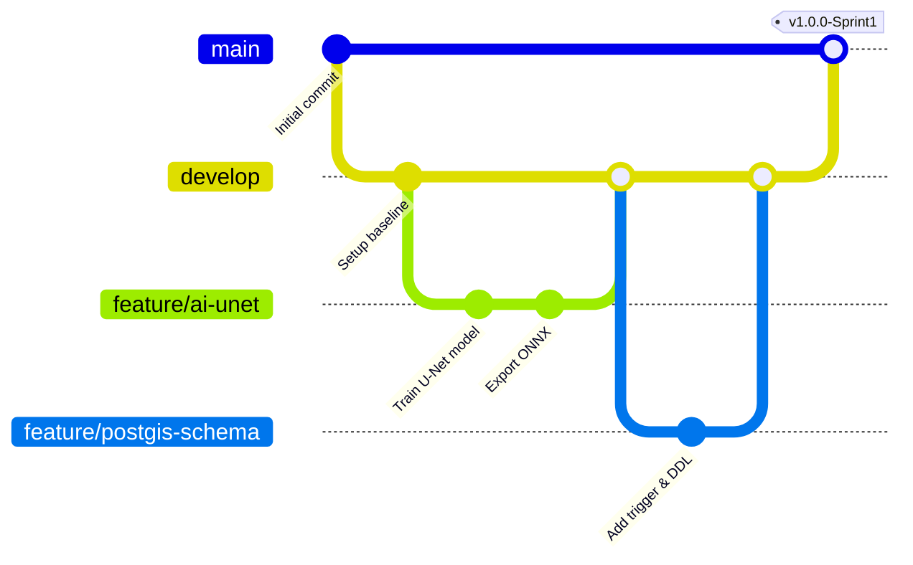

# Hướng Dẫn Thiết Lập GitHub Repo Cho Kiến Trúc Microservices (GeoSentry / TerraWatch)

Tài liệu này hướng dẫn chi tiết cách tổ chức và quản trị GitHub repository cho dự án Capstone **GeoSentry** với 5 thành viên phát triển theo kiến trúc Microservices.

---

## 1. Lựa Chọn Chiến Lược Repo: Modular Monorepo (Khuyến Nghị)

### Tại sao chọn Monorepo cho nhóm Capstone (5 người)?
| Tiêu chí | Monorepo (1 Repo duy nhất) | Multi-repo (Mỗi service 1 Repo) |
| :--- | :--- | :--- |
| **Phối hợp nhóm** | **Rất cao**: Cả 5 người nhìn thấy toàn cảnh, dễ review code chéo. | **Thấp**: Rời rạc, khó theo dõi tiến độ tổng thể. |
| **Chạy Local (Docker)** | **1 lệnh**: `docker-compose up` khởi động toàn bộ hệ thống ngay. | Phức tạp: Phải clone 5 repo, liên kết mạng docker thủ công. |
| **Hợp đồng API (Contract)** | Thay đổi DTO/Schema cập nhật đồng bộ trong 1 Pull Request. | Phải tạo PR trên từng repo, dễ lệch phiên bản (drift). |
| **CI/CD** | Dùng **Path-based triggering** (chỉ build service có thay đổi code). | Mỗi repo 1 pipeline riêng nhưng khó test end-to-end liên repo. |

> **Kết luận**: Với nhóm 5 người làm đồ án tốt nghiệp, **Modular Monorepo** là mô hình chuẩn mực nhất: vừa tách biệt độc lập từng service (mỗi service có Dockerfile, package.json / requirements.txt riêng), vừa dùng chung một repository trên GitHub.

---

## 2. Thiết Lập Nhánh & Quản Trị Git (Branching Strategy)

Áp dụng mô hình **GitFlow rút gọn (Trunk-based with Feature Branches)**:

### Quy ước đặt tên nhánh theo WBS:
- `feature/ai-<tên_tính_năng>`: Dành cho Thành viên 1 (AI Engineer)
  - Ví dụ: `feature/ai-landslide4sense-onnx`, `feature/ai-batch-inference`
- `feature/gis-<tên_tính_năng>`: Dành cho Thành viên 2 (GIS Engineer)
  - Ví dụ: `feature/gis-gee-pipeline`, `feature/gis-mvt-tiles`
- `feature/core-<tên_tính_năng>`: Dành cho Thành viên 3 (Backend Engineer)
  - Ví dụ: `feature/core-verification-queue`, `feature/core-fcm-alert`
- `feature/webgis-<tên_tính_năng>`: Dành cho Thành viên 4 (Frontend WebGIS)
  - Ví dụ: `feature/webgis-split-map`, `feature/webgis-officer-dashboard`
- `feature/mobile-<tên_tính_năng>`: Dành cho Thành viên 5 (Mobile Engineer)
  - Ví dụ: `feature/mobile-offline-geofence`, `feature/mobile-crowdsourcing`

---

## 3. Cấu Hình Branch Protection Rules Trên GitHub

Để bảo vệ nhánh chính và đảm bảo chất lượng đồ án, hãy cấu hình trên GitHub:
1. Vào **Settings** -> **Branches** -> Chọn **Add branch ruleset** hoặc **Branch protection rule**.
2. Áp dụng cho nhánh `main` và `develop`:
   - ☑️ **Require a pull request before merging** (Bắt buộc tạo PR, không push thẳng lên `main`).
   - ☑️ **Require approvals**: Tối thiểu 1 phê duyệt (Approved) từ đồng đội.
   - ☑️ **Require status checks to pass before merging**: Chọn các workflow GitHub Actions (`CI - Core API`, `CI - AI Service`, etc.).
   - ☑️ **Require conversation resolution before merging**: Bắt buộc giải quyết hết các comment review.

---

## 4. Tự Động Hóa CI/CD Theo Đường Dẫn (Path-based CI)

Hệ thống đã được cài đặt sẵn 3 workflow trong `.github/workflows/`:
- `ci-core-api.yml`: Chỉ kích hoạt khi có thay đổi trong thư mục `services/core-api/**`.
- `ci-ai-service.yml`: Chỉ kích hoạt khi có thay đổi trong `services/ai-service/**`.
- `ci-webgis.yml`: Chỉ kích hoạt khi có thay đổi trong `apps/webgis/**`.

Khi 1 thành viên commit code cho service của mình, GitHub Actions chỉ kiểm tra và build duy nhất service đó, giúp tiết kiệm thời gian và tài nguyên GitHub Actions runner.

---

## 5. Sử Dụng BMAD & Ponytail Trong Quá Trình Phát Triển

Repository đã được tích hợp sẵn 2 công cụ AI Agentic tiên tiến:
1. **BMAD Method (`_bmad/`, `.agents/skills/bmad-*`)**:
   - Sử dụng các skill lập kế hoạch: `/bmad-brainstorming`, `/bmad-create-prd`, `/bmad-architecture`, `/bmad-sprint-planning`.
   - Giúp cả nhóm chia nhỏ sprint, viết story và thiết kế tài liệu chuẩn chỉnh.
2. **Ponytail (`.agents/rules/ponytail.md`, `.agents/skills/ponytail`)**:
   - Tối ưu hóa code của AI: Ưu tiên đơn giản hóa, loại bỏ code thừa (YAGNI), tái sử dụng code có sẵn, không cài dependency dư thừa.
